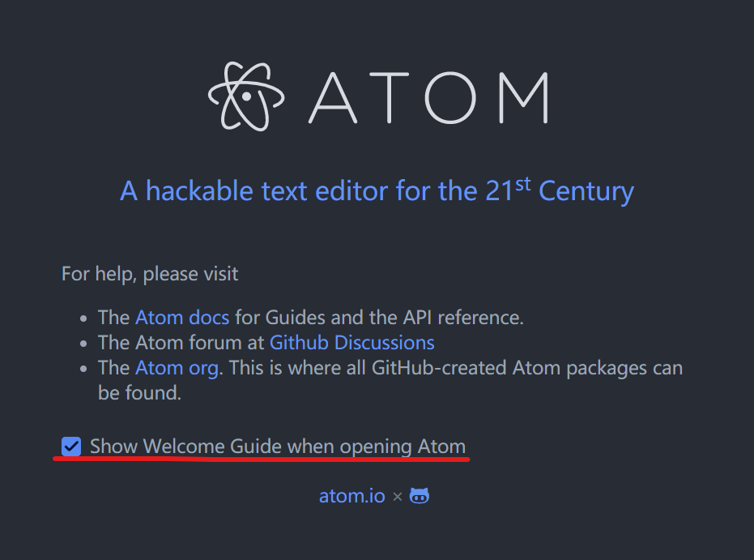
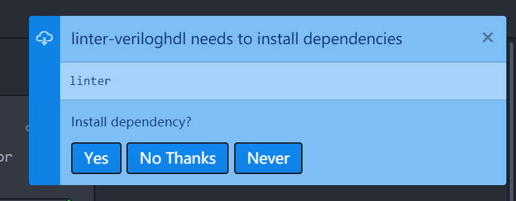
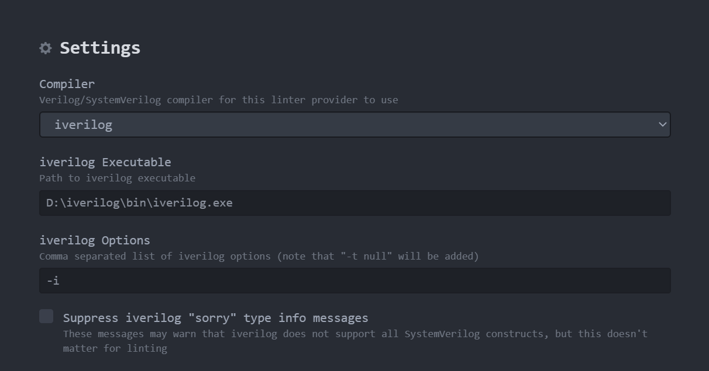

# 告别VSCode，使用Atom作为Vivado外部Editor  
## 起因  
不知道是不是微软啊三的屎手伸向了VSCode，最近发现在配置VSCode作为Vivado外部Editor后，在体积较大的Project中跳转到VSCode时，出现高频率的崩溃，高CPU、内存和硬盘占用，页面无响应。因此最近不得不放弃VSCode。

## 目标
一个带代码补全和语法检查的Editor

## Atom简单安装与设置
从[Atom 主页](https://atom.io/)下载并安装编辑器，启动Atom后，建议取消勾选**Show Welcome Guide when opening Atom**。
  
然后菜单File->Settings->Install，搜索**simplified-chinese-menu**并安装即可将Atom界面汉化(初次接触者还是需要中文的帮助来熟悉Editor)。如果连接不上，可能需要魔法的帮助，参考[Atom/apm github首页](https://github.com/atom/apm#behind-a-firewall)  
我个人比较喜欢VSCode的代码预览窗口，所以也在Atom安装了可以实现相似功能插件**minimap**  
然后可以在设置页面换自己喜欢的主题。探索一下设置。  

## Verilog插件安装与设置
首先去[http://bleyer.org/icarus/](http://bleyer.org/icarus/)下载安装iVerilog的windows安装包。这里选择*iverilog-v11-20210204-x64_setup.exe*，点击安装，**注意路径不能包含空格和中文!**  

继续在菜单File(菜单)->Settings(设置)->Install(安装)，搜索**language-verilog**并安装。
搜索**linter-veriloghdl**并安装，linter-veriloghdl在安装过程中会提示你是否安装依赖Linter，选择是。  
   

等待Linter安装完成，配置linter-veriloghdl。在设置->扩展中选择linter-veriloghdl的设置，然后如下图，选择iverilog为compiler，iverilog Executable填入**iverilog路径\bin\iverilog.exe**，Options填-i(因为在使用Linter检测语法时，编译器会对没有找到的Module报错，这个我们需要忽略)。  
   

## 设置Vivado  

启动Vivado，菜单->Tools->Settings->Text Editor ，Current Editor选择Custom Editor，然后点击右边的三个点设置Custom Editor。填入
```
<Atom安装路径>\atom\atom.exe [file name]:[line number]
```
保存即可完成设置。

